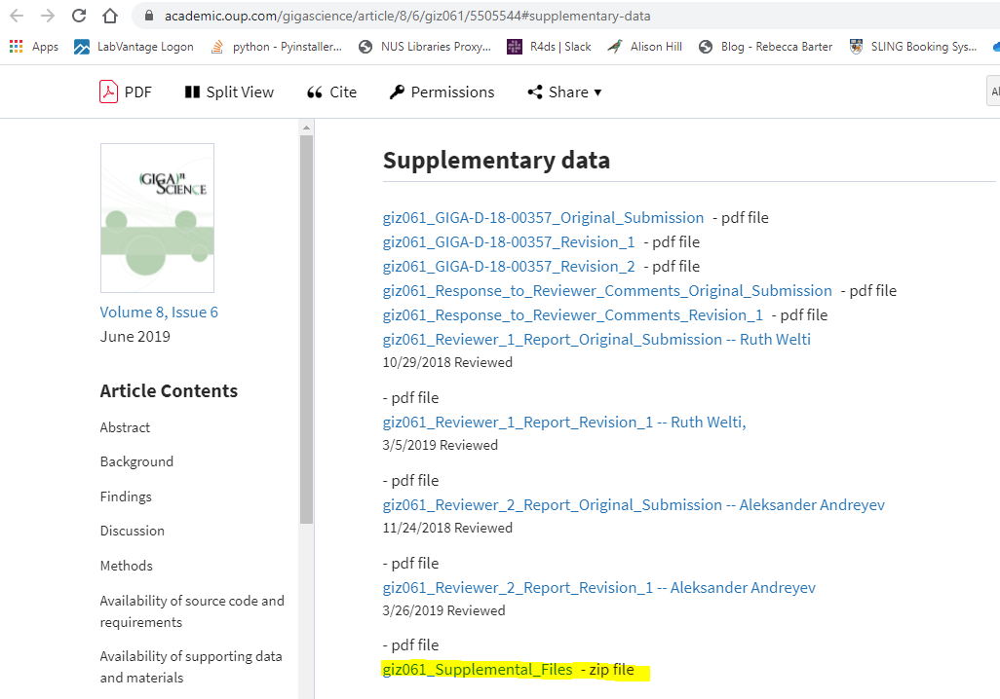
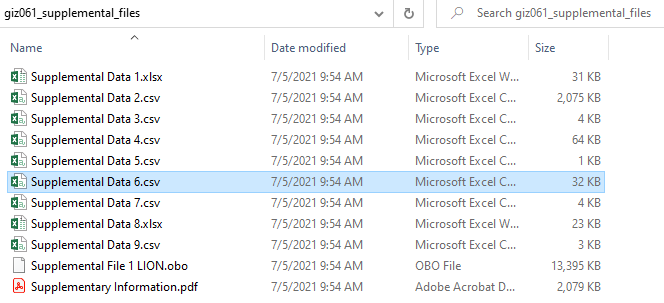
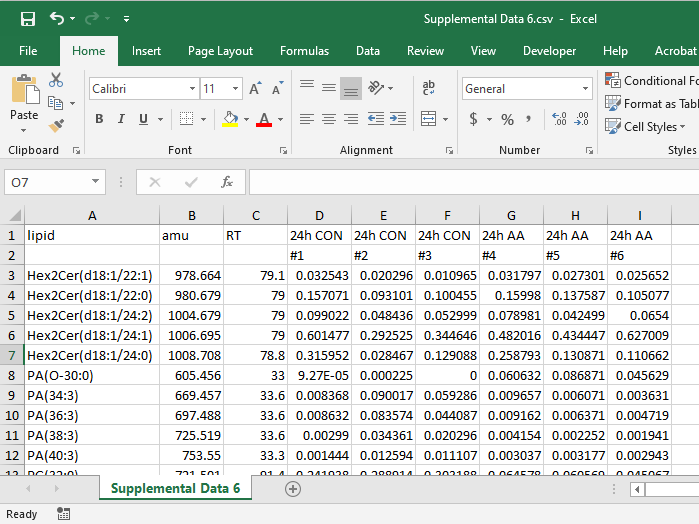
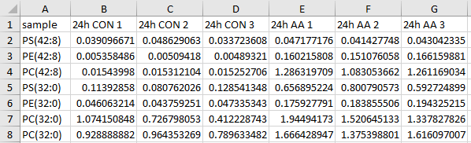
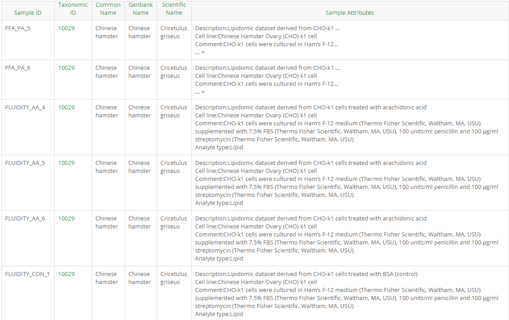

The data used in this tutorial is taken from this [paper](https://academic.oup.com/gigascience/article/8/6/giz061/5505544) [@LION]

## Download Data

To download the data, scroll down to the "Supplementary data" Section and click on "giz061_Supplemental_Files"

Unzip the folder and go to Supplemental Data 6.csv

## Data Preview

The data should look like this when opened

For this tutorial, a small subset is used

## Data Description

Description for each column can be found [here](http://gigadb.org/dataset/view/id/100599/Sample_page/2)

