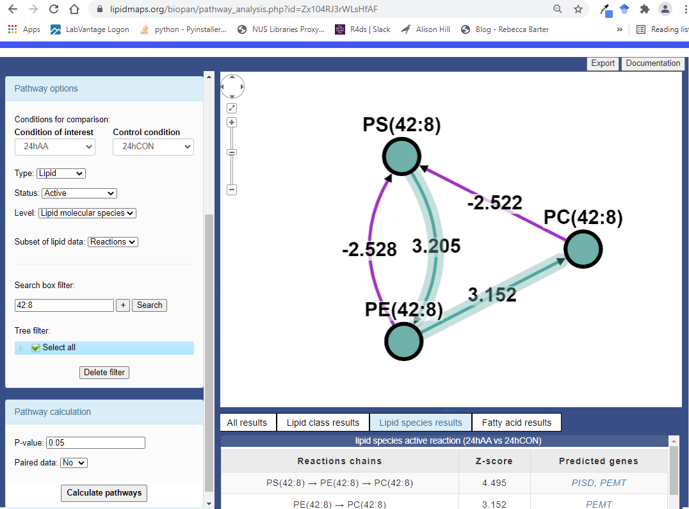
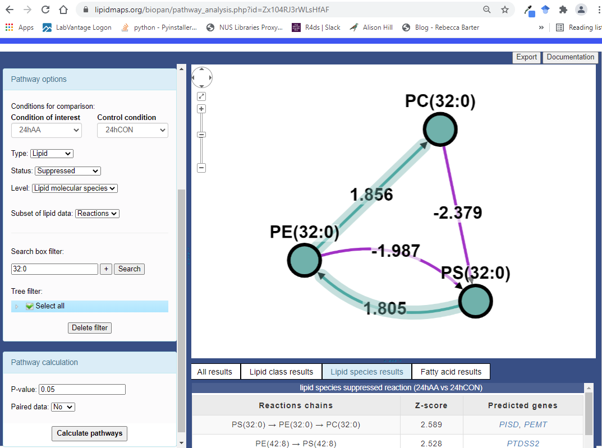

## Active Case

Let us consider the pathway of `PS(42:8)` to `PE(42:8)` to `PC(42:8)`.



The dataset are as follows:

```{r label=Active_Species_Data, fig.height=figheight, fig.width=figwidth, message=FALSE, warning=FALSE, dpi=150}

samples <- c("24h CON", "24h CON", "24h CON",
             "24h AA", "24h AA", "24h AA")

group <- c("CON", "CON", "CON",
             "AA", "AA", "AA")

PS42_8 <- c(0.039096671,	0.048629063,	0.033723608,
            0.047177176,	0.041427748,	0.043042335)

PE42_8 <- c(0.005358486,	0.00509418,	0.00489321,
            0.160215808,	0.151076058,	0.166159881)

PC42_8 <- c(0.01543998,	0.015312104,	0.015252706,
            1.286319709,	1.083053662,	1.261169034)

active_data <- tibble::tibble(
  Sample = samples,
  Group = group,
  `PS(42:8)` = PS42_8,
  `PE(42:8)` = PE42_8,
  `PC(42:8)` = PC42_8
)

active_data
```

### `PS(42:8)` to `PE(42:8)`

**Compute the weight for product `PE(42:8)` over reactant `PS(42:8)` for each sample.**

```{r label=weight_vector_PE42_8_over_PS42_8, message=FALSE, warning=FALSE}
weights <- (active_data$`PE(42:8)`/active_data$`PS(42:8)`)
active_data <- active_data %>%
  dplyr::mutate(`PE(42:8) over PS(42:8)` = weights)

active_data %>%
  dplyr::select(-c(.data$`PC(42:8)`))
```

**Compute a one-sided Welch $t$-test between the samples of interest (Group AA) and the control samples (Group CON).**

```{r label=t.test_PE42_8_over_PS42_8, message=FALSE, warning=FALSE, results='asis'}

aa_samples <- active_data %>%
  dplyr::filter(.data$Group == "AA") %>%
  dplyr::pull(.data$`PE(42:8) over PS(42:8)`)

control_samples <- active_data %>%
  dplyr::filter(.data$Group == "CON") %>%
  dplyr::pull(.data$`PE(42:8) over PS(42:8)`)

t1 <- t.test(aa_samples, control_samples, alternative = "greater")

report::report(t1)
cat(paste("$p$ value is", format(t1$p.value, scientific = TRUE, nsmall = 3)))
```

**Convert the $p$ value into a $Z$ Score.**

This is also the pathway score for `PS(42:8)` to `PE(42:8)`.

```{r label=Zscore_PE42_8_over_PS42_8, message=FALSE, warning=FALSE, results='asis'}

z_score1 <- qnorm(1 - t1$p.value)
cat(paste("$Z$ score for `PS(42:8)` to `PE(42:8)` is", format(z_score1, nsmall = 3)))
```

### `PE(42:8)` to `PC(42:8)`

**Compute the weight for product `PC(42:8)` over reactant `PE(42:8)` for each sample.**

```{r label=weight_vector_PC42_8_over_PE42_8, message=FALSE, warning=FALSE}
weights <- (active_data$`PC(42:8)`/active_data$`PE(42:8)`)
active_data <- active_data %>%
  dplyr::mutate(`PC(42:8) over PE(42:8)` = weights)

active_data %>%
  dplyr::select(-c(.data$`PS(42:8)`,.data$`PE(42:8) over PS(42:8)`))
```

**Compute a one-sided Welch $t$-test between the samples of interest (Group AA) and the control samples (Group CON).**

```{r label=t.test_PC42_8_over_PE42_8, message=FALSE, warning=FALSE, results='asis'}

aa_samples <- active_data %>%
  dplyr::filter(.data$Group == "AA") %>%
  dplyr::pull(.data$`PC(42:8) over PE(42:8)`)

control_samples <- active_data %>%
  dplyr::filter(.data$Group == "CON") %>%
  dplyr::pull(.data$`PC(42:8) over PE(42:8)`)

t2 <- t.test(aa_samples, control_samples, alternative = "greater")
report::report(t2)
cat(paste("$p$ value is", format(t2$p.value, scientific = TRUE, nsmall = 3)))
```

**Convert the $p$ value into a $Z$ score.**

This is also the pathway score for `PE(42:8)` to `PC(42:8)`.

```{r label=Zscore_PC42_8_over_PE42_8, message=FALSE, warning=FALSE, results='asis'}
z_score2 <- qnorm(1 - t2$p.value)
cat(paste("$Z$ score for `PE(42:8)` to `PC(42:8)` is", format(z_score2, nsmall = 3)))
```

**Compute $Z_{A}$ for pathway `PS(42:8)` to `PE(42:8)` to `PC(42:8)`.**

Recall the formula is defined as:


where $k$ is 2 and $Z_{i}$ are the pathway scores `PS(42:8)` to `PE(42:8)` and `PE(42:8)` to `PC(42:8)` computed earlier. 

```{r label=Zscore_active_pathway, message=FALSE, warning=FALSE, results='asis'}
z_a <- (1/sqrt(2)) * (z_score1 + z_score2)
cat(paste("$Z_{A}$ is", format(z_a, nsmall = 3)))
```

With this settings,


Since $Z_{A} > 1.645$, the pathway is classified as active.

## Suppressed Case

Let us consider the pathway of `PS(32:0)` to `PE(32:0)` to `PC(32:0)`.



The dataset are as follows:

```{r label=Suppressed_Species_Data_1, fig.height=figheight, fig.width=figwidth, message=FALSE, warning=FALSE, dpi=150}

samples <- c("24h CON", "24h CON", "24h CON",
             "24h AA", "24h AA", "24h AA")

group <- c("CON", "CON", "CON",
           "AA", "AA", "AA")

PS32_0 <- c(0.11392858,	0.080762026,	0.128541348,
            0.656895224,	0.800790573,	0.592724899)

PE32_0 <- c(0.046063214,	0.043759251,	0.047335343,
            0.175927791,	0.183855506,	0.194325215)

PC32_0_1 <- c(1.074150848, 0.726798053, 0.412228743,
              1.94494173, 1.520645133, 1.337827826)

PC32_0_2 <- c(0.928888882, 0.964353269, 0.789633482,
              1.666428947, 1.375398801, 1.616097007)

suppressed_data <- tibble::tibble(
  Sample = samples,
  Group = group,
  `PS(32:0)` = PS32_0,
  `PE(32:0)` = PE32_0,
  `PC(32:0) 1` = PC32_0_1,
  `PC(32:0) 2` = PC32_0_2
)

suppressed_data
```

BioPAN will give a warning on the duplicated transition `PC(32:0)` and sum them up.


```{r label=Suppressed_Species_Data_2, fig.height=figheight, fig.width=figwidth, message=FALSE, warning=FALSE, dpi=150}

suppressed_data <- tibble::tibble(
  Sample = samples,
  Group = group,
  `PS(32:0)` = PS32_0,
  `PE(32:0)` = PE32_0,
  `PC(32:0)` = PC32_0_1 + PC32_0_2
)

suppressed_data
```

### `PS(32:0)` to `PE(32:0)`

**Compute the weight for product `PE(32:0)` over reactant `PS(32:0)` for each sample.**

```{r label=weight_vector_PE32_0_over_PS32_0, message=FALSE, warning=FALSE}
weights <- (suppressed_data$`PE(32:0)`/suppressed_data$`PS(32:0)`)
suppressed_data <- suppressed_data %>%
  dplyr::mutate(`PE(32:0) over PS(32:0)` = weights)

suppressed_data %>%
  dplyr::select(-c(.data$`PC(32:0)`))
```

**Compute a one-sided Welch $t$-test between the samples of interest (Group AA) and the control samples (Group CON).**

```{r label=t.test_PE32_0_over_PS32_0, message=FALSE, warning=FALSE, results='asis'}

aa_samples <- suppressed_data %>%
  dplyr::filter(.data$Group == "AA") %>%
  dplyr::pull(.data$`PE(32:0) over PS(32:0)`)

control_samples <- suppressed_data %>%
  dplyr::filter(.data$Group == "CON") %>%
  dplyr::pull(.data$`PE(32:0) over PS(32:0)`)

t1 <- t.test(aa_samples, control_samples, alternative = "less")
report::report(t1)
cat(paste("$p$ value is", format(t1$p.value, scientific = TRUE, nsmall = 3)))
```

**Convert the $p$ value into a $Z$ score.**

This is also the pathway score for `PS(32:0)` to `PE(32:0)`.

```{r label=Zscore_PE32_0_over_PS32_0, message=FALSE, warning=FALSE, results='asis'}
z_score1 <- qnorm(1 - t1$p.value)
cat(paste("$Z$ score for`PS(32:0)` to `PE(32:0)` is", format(z_score1, nsmall = 3)))
```

### `PE(32:0)` to `PC(32:0)`

**Compute the weight for product `PC(32:0)` over reactant `PE(32:0)` for each sample.**

```{r label=weight_vector_PC32_0_over_PE32_0, message=FALSE, warning=FALSE}
weights <- (suppressed_data$`PC(32:0)`/suppressed_data$`PE(32:0)`)
suppressed_data <- suppressed_data %>%
  dplyr::mutate(`PC(32:0) over PE(32:0)` = weights)

suppressed_data %>%
  dplyr::select(-c(.data$`PS(32:0)`,.data$`PE(32:0) over PS(32:0)`))
```

**Compute a one-sided Welch $t$-test between the samples of interest (Group AA) and the control samples (Group CON).**

```{r label=t.test_PC32_0_over_PE32_0, message=FALSE, warning=FALSE, results='asis'}

aa_samples <- suppressed_data %>%
  dplyr::filter(.data$Group == "AA") %>%
  dplyr::pull(.data$`PC(32:0) over PE(32:0)`)

control_samples <- suppressed_data %>%
  dplyr::filter(.data$Group == "CON") %>%
  dplyr::pull(.data$`PC(32:0) over PE(32:0)`)

t2 <- t.test(aa_samples, control_samples, alternative = "less")
report::report(t2)
cat(paste("$p$ value is", format(t2$p.value, scientific = TRUE, nsmall = 3)))
```

**Convert the $p$ value into a $Z$ score.**

This is also the pathway score for `PE(32:0)` to `PC(32:0)`.

```{r label=Zscore_PC32_0_over_PE32_0, message=FALSE, warning=FALSE, results='asis'}
z_score2 <- qnorm(1 - t2$p.value)
cat(paste("$Z$ score for `PE(32:0)` to `PC(32:0)` is", format(z_score2, nsmall = 3)))
```

**Compute $Z_{A}$ for pathway `PS(32:0)` to `PE(32:0)` to `PC(32:0)`.**

Recall the formula is defined as:


where $k$ is 2 and $Z_{i}$ are the pathway scores `PS(32:0)` to `PE(32:0)` and `PE(32:0)` to `PC(32:0)` computed earlier. 

```{r label=Zscore_suppressed_pathway, message=FALSE, warning=FALSE, results='asis'}
z_a <- (1/sqrt(2)) * (z_score1 + z_score2)
cat(paste("$Z_{A}$ is", format(z_a, nsmall = 3)))
```

With this settings,


Since $Z_{A} > 1.645$, the pathway is classified as suppressed.
