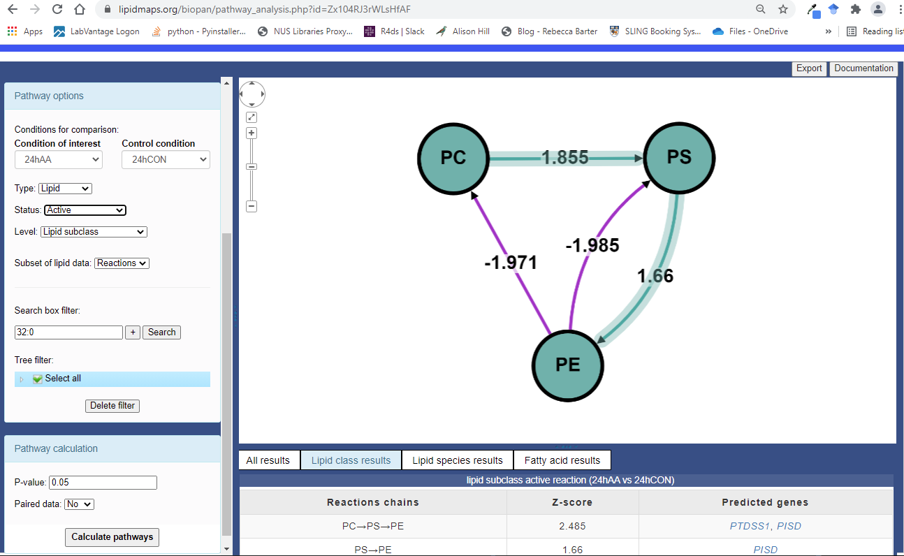
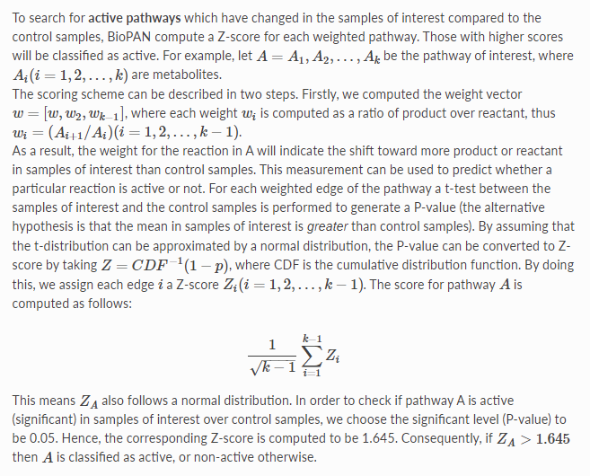

<!-- 
!!!! IMPORTANT: run `source("utils/render.R")` to publish instead of clicking on 'Knit'
# See https://yihui.org/knitr/options/
-->

```{r setup, warning=FALSE, message=TRUE, include=FALSE}
# Set up the environment

# Options relative to figure size
# 1.618 is the golden ratio
figheight <- 4
figwidth <- 4 * 1.618 

# General options
options(knitr.kable.NA = "",
        digits = 3,
        tidyverse.quiet = TRUE)

# Chunk options (see https://yihui.org/knitr/options/#chunk_options)
knitr::opts_chunk$set(
  comment = ">",  # The prefix to be added before each line of the text output.
  dpi = 600,
  fig.path = "figures/",
  fig.height = figheight,
  fig.width = figwidth,
  # See https://community.rstudio.com/t/centering-images-in-blogdown-post/20962
  # to learn how to center images
  # See https://bookdown.org/yihui/rmarkdown-cookbook/opts-tidy.html
  # See https://www.zotero.org/styles for citation style respository
  tidy='styler',
  tidy.opts=list(strict=TRUE)
)

fast <- FALSE  # Make this false to skip the chunks
```

# Agenda

This document helps to explain how the number displayed in the BioPAN software are calculated using a small dataset as an example.

# About BioPAN

[BioPAN](https://f1000research.com/articles/10-4) [@BIOPAN] is a tool found in [LIPID MAPS](https://lipidmaps.org/biopan) designed to automate biosynthetic pathway analysis of lipids.

<p align="center">

</p>

Below is a [YouTube video](https://www.youtube.com/watch?v=EfTC_LuR3ak) on how to use BioPAN.

<p align="center">
<iframe width="560" height="315" src="https://www.youtube.com/embed/EfTC_LuR3ak" frameborder="0" allowfullscreen></iframe>
</p>

The [documentation](https://www.lipidmaps.org/biopan/doc/step3_build.html) of BioPAN provides a technical explanation of how the pathway scores are calculated.

<p align="center">

</p>

More information can be found in this [paper](https://doi.org/10.1016/j.copbio.2016.10.003) [@NGUYEN201796]

# Packages

```{r warning=FALSE, message=FALSE, results='asis'}
library(dplyr)
library(magrittr)
library(report)
summary(report::report(sessionInfo()))
```

# Data {.tabset}

```{r child=if (fast == FALSE) '1_about_data.Rmd'}

```

# BioPAN on Lipid Species {.tabset}

```{r child=if (fast == FALSE) '2_BioPAN_species_case.Rmd'}

```

# BioPAN on Lipid Class {.tabset}

```{r child=if (fast == FALSE) '3_BioPAN_class_case.Rmd'}

```

# Rmarkdown Template

This Rmarkdown template is created by the [Reality Bending Lab](https://realitybending.github.io/). The template can be download from the lab's [github](https://github.com/RealityBending/TemplateResults#package-references) account. For more information about the motivation behind creating this template, check out [Dr. Dominique Makowski's blog post](https://dominiquemakowski.github.io/post/template_results/)

# Package References
```{r warning=FALSE, message=TRUE, results='asis'}
report::cite_packages(sessionInfo())
```


# References
